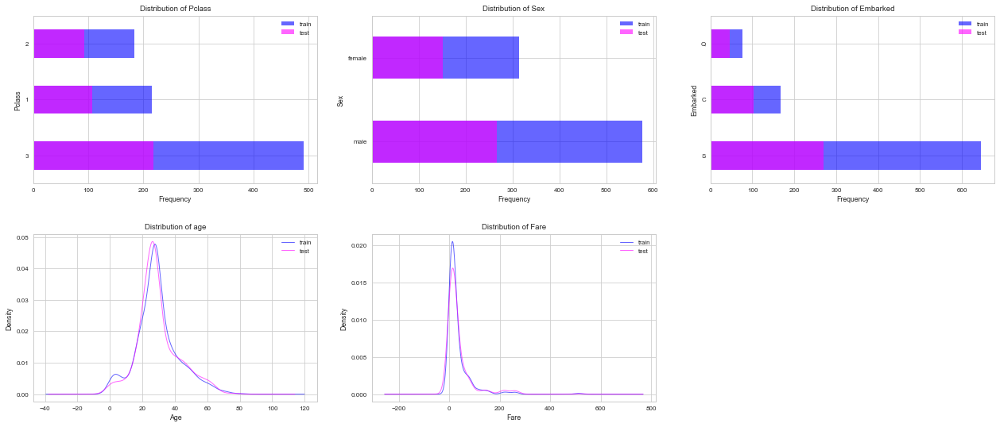
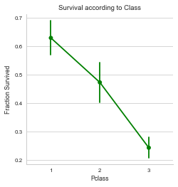
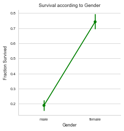
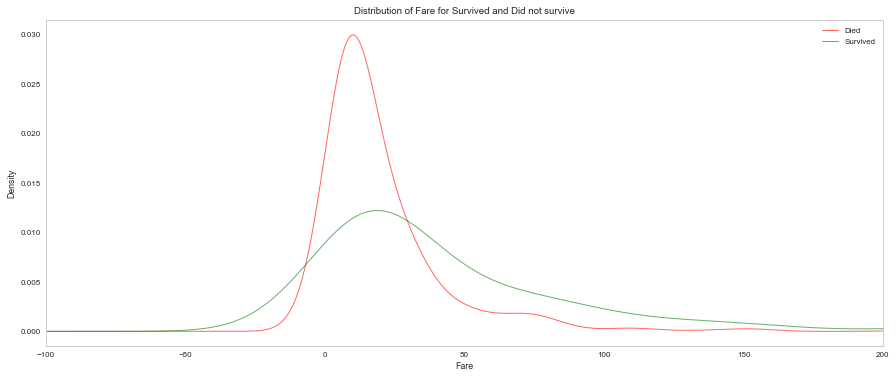
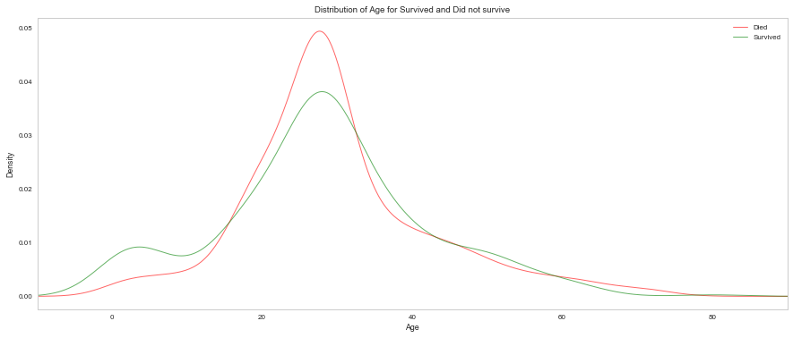

# Introduction

This is my first project with Kaggle:
[_Titanic: Machine Learning from Disaster
Start here! Predict survival on the Titanic and get familiar with ML basics_](https://www.kaggle.com/c/titanic)


This was a great project for me to start as the data is fairly clean and the calculations are relatively simple. 

My project has following parts
* Feature engineering
* Missing value imputation
* Prediction!

## Load and understand data


```python
# Imports

# pandas
import pandas as pd
from pandas import Series,DataFrame

# numpy, matplotlib, seaborn
import numpy as np
import matplotlib.pyplot as plt
import seaborn as sns
sns.set_style('whitegrid')
%matplotlib inline

# machine learning
from sklearn.linear_model import LogisticRegression
from sklearn.svm import SVC, LinearSVC
from sklearn.ensemble import RandomForestClassifier
from sklearn.neighbors import KNeighborsClassifier
from sklearn.naive_bayes import GaussianNB
```

I started off with the packages that I needed right away such as **numpy** and **pandas** 
and added more as and when I needed more packages.
Now lets take a look at our data that I have loaded in a variable called titanic_DF.

I have used the following command to see the first two rows of the data. 
```python
titanic_DF.head(2)
```


```python
# Loading data and printing first few rows
titanic_DF = pd.read_csv('train.csv')
test_DF = pd.read_csv('test.csv')

titanic_DF.head(2)
```


<div>
<table border="1" class="dataframe">
  <thead>
    <tr style="text-align: right;">
      <th></th>
      <th>PassengerId</th>
      <th>Survived</th>
      <th>Pclass</th>
      <th>Name</th>
      <th>Sex</th>
      <th>Age</th>
      <th>SibSp</th>
      <th>Parch</th>
      <th>Ticket</th>
      <th>Fare</th>
      <th>Cabin</th>
      <th>Embarked</th>
    </tr>
  </thead>
  <tbody>
    <tr>
      <th>0</th>
      <td>1</td>
      <td>0</td>
      <td>3</td>
      <td>Braund, Mr. Owen Harris</td>
      <td>male</td>
      <td>22.0</td>
      <td>1</td>
      <td>0</td>
      <td>A/5 21171</td>
      <td>7.2500</td>
      <td>NaN</td>
      <td>S</td>
    </tr>
    <tr>
      <th>1</th>
      <td>2</td>
      <td>1</td>
      <td>1</td>
      <td>Cumings, Mrs. John Bradley (Florence Briggs Th...</td>
      <td>female</td>
      <td>38.0</td>
      <td>1</td>
      <td>0</td>
      <td>PC 17599</td>
      <td>71.2833</td>
      <td>C85</td>
      <td>C</td>
    </tr>
  </tbody>
</table>
</div>


```python
# Similarly look into test data 
test_DF.head(2)
```


<div>
<table border="1" class="dataframe">
  <thead>
    <tr style="text-align: right;">
      <th></th>
      <th>PassengerId</th>
      <th>Pclass</th>
      <th>Name</th>
      <th>Sex</th>
      <th>Age</th>
      <th>SibSp</th>
      <th>Parch</th>
      <th>Ticket</th>
      <th>Fare</th>
      <th>Cabin</th>
      <th>Embarked</th>
    </tr>
  </thead>
  <tbody>
    <tr>
      <th>0</th>
      <td>892</td>
      <td>3</td>
      <td>Kelly, Mr. James</td>
      <td>male</td>
      <td>34.5</td>
      <td>0</td>
      <td>0</td>
      <td>330911</td>
      <td>7.8292</td>
      <td>NaN</td>
      <td>Q</td>
    </tr>
    <tr>
      <th>1</th>
      <td>893</td>
      <td>3</td>
      <td>Wilkes, Mrs. James (Ellen Needs)</td>
      <td>female</td>
      <td>47.0</td>
      <td>1</td>
      <td>0</td>
      <td>363272</td>
      <td>7.0000</td>
      <td>NaN</td>
      <td>S</td>
    </tr>
  </tbody>
</table>
</div>


Another way to understand the data and find out if there are missing data is to use 
```python 
data.describe()
```
or 
```python 
data.info()
```

This command will print all the statistical information of the data, including how many data points each column have. For instance you can see the age column only has 714 non NULL data  as opposed to PassengerId that has 891.

Similarly the test data also has missing values in several columns. I have commented the test_DF.info() out, but you can uncomment and check. 


```python
# Previewing the statistics of training data and test data
titanic_DF.info()
# print('')
# test_DF.info()
```

    <class 'pandas.core.frame.DataFrame'>
    RangeIndex: 891 entries, 0 to 890
    Data columns (total 12 columns):
    PassengerId    891 non-null int64
    Survived       891 non-null int64
    Pclass         891 non-null int64
    Name           891 non-null object
    Sex            891 non-null object
    Age            714 non-null float64
    SibSp          891 non-null int64
    Parch          891 non-null int64
    Ticket         891 non-null object
    Fare           891 non-null float64
    Cabin          204 non-null object
    Embarked       889 non-null object
    dtypes: float64(2), int64(5), object(5)
    memory usage: 83.6+ KB


```python
# Data Visualization 
plt.rc('font', size=24)
fig = plt.figure(figsize=(18, 8))
alpha = 0.6

# Plot pclass distribution
ax1 = plt.subplot2grid((2,3), (0,0))
titanic_DF.Pclass.value_counts().plot(kind='barh', color='blue', label='train', alpha=alpha)
test_DF.Pclass.value_counts().plot(kind='barh',color='magenta', label='test', alpha=alpha)
ax1.set_ylabel('Pclass')
ax1.set_xlabel('Frequency')
ax1.set_title("Distribution of Pclass" )
plt.legend(loc='best')

# Plot sex distribution
ax2 = plt.subplot2grid((2,3), (0,1))
titanic_DF.Sex.value_counts().plot(kind='barh', color='blue', label='train', alpha=alpha)
test_DF.Sex.value_counts().plot(kind='barh', color='magenta', label='test', alpha=alpha)
ax2.set_ylabel('Sex')
ax2.set_xlabel('Frequency')
ax2.set_title("Distribution of Sex" )
plt.legend(loc='best')


# Plot Embarked Distribution
ax5 = plt.subplot2grid((2,3), (0,2))
titanic_DF.Embarked.fillna('S').value_counts().plot(kind='barh', color='blue', label='train', alpha=alpha)
test_DF.Embarked.fillna('S').value_counts().plot(kind='barh',color='magenta', label='test', alpha=alpha)
ax5.set_ylabel('Embarked')
ax5.set_xlabel('Frequency')
ax5.set_title("Distribution of Embarked" )
plt.legend(loc='best')

# Plot Age distribution
ax3 = plt.subplot2grid((2,3), (1,0))
titanic_DF.Age.fillna(titanic_DF.Age.median()).plot(kind='kde', color='blue', label='train', alpha=alpha)
test_DF.Age.fillna(test_DF.Age.median()).plot(kind='kde',color='magenta', label='test', alpha=alpha)
ax3.set_xlabel('Age')
ax3.set_title("Distribution of age" )
plt.legend(loc='best')

# Plot fare distribution
ax4 = plt.subplot2grid((2,3), (1,1))
titanic_DF.Fare.fillna(titanic_DF.Fare.median()).plot(kind='kde', color='blue', label='train', alpha=alpha)
test_DF.Fare.fillna(test_DF.Fare.median()).plot(kind='kde',color='magenta', label='test', alpha=alpha)
ax4.set_xlabel('Fare')
ax4.set_title("Distribution of Fare" )
plt.legend(loc='best')

plt.tight_layout()


```





We’ve got a good sense of our 12 variables in our training data frame, variable types, and the variables that have missing data. The next section now is feature engineering!


# Feature Engineering

Feature engineering is the process of using our knowledge of the data to create features that make machine learning algorithms work. And as per Andrew Ng, 

> Coming up with features is difficult, time-consuming, requires expert knowledge. 
> "Applied machine learning" is basically feature engineering. 

So the challenge for me as a beginner was to pay a lot of attention to the various variables that could be potential features and with an open mind. Lets list our potential features one more time and the data dictionary to decide which ones we can use.

Data Dictionary


| Variable      | Definition    | Key  |
| ------------- |:-------------:| -----:|
| survival      | _Survival_ | 0 = No, 1 = Yes |
| pclass      | _Ticket class_      |   1 = 1st, 2 = 2nd, 3 = 3rd |
| sex |  _Sex_      |     |
| Age | _Age in years_| |
| sibsp| _# of siblings / spouses aboard_| |
| parch|_# of parents / children aboard_ | |
| ticket|	_Ticket number_|	|
| fare	|_Passenger fare_|	|
| cabin	| _Cabin number_ |	|
| embarked|	_Port of Embarkation_|	C = Cherbourg, Q = Queenstown, S = Southampton


```python
# print the names of the columns in the data frame
titanic_DF.columns
# Check which columns have missing data
for column in titanic_DF.columns:
    if np.any(pd.isnull(titanic_DF[column])) == True:
        print(column)
```

    Age
    Cabin
    Embarked


## Visualizing Features
First I generated a distribution of various features for both training and test data of system to understand which factors are important. [Credit](https://www.kaggle.com/arthurlu/titanic/exploratory-tutorial-titanic)

Then, I started plotting the survival frequency to understand my features better and in the process play around with plotting styles (I used Seaborn for most of these plots).

[Seaborn is a Python visualization library based on matplotlib. It provides a high-level interface for drawing attractive statistical graphics](https://seaborn.pydata.org/introduction.html#introduction)


```python
# Plot pclass distribution
fig = plt.figure(figsize=(6, 6))

sns.factorplot('Pclass','Survived',order=[1,2,3], data=titanic_DF, size=4,color="green")
plt.ylabel('Fraction Survived')
plt.xlabel('Pclass')
plt.title("Survival according to Class" )
```


    <matplotlib.text.Text at 0x1336817b8>


    <matplotlib.figure.Figure at 0x13272f080>





```python
# Plot Gender Survival
fig = plt.figure(figsize=(6,6))
sns.factorplot('Sex','Survived', data=titanic_DF, size=4,color="green")
plt.ylabel('Fraction Survived')
plt.xlabel('Gender')
plt.title("Survival according to Gender" )
```


    <matplotlib.text.Text at 0x134548438>


    <matplotlib.figure.Figure at 0x1336a6208>





```python
# Plot Fare
fig = plt.figure(figsize=(15, 6))
titanic_DF[titanic_DF.Survived==0].Fare.plot(kind='density', color='red', label='Died', alpha=alpha)
titanic_DF[titanic_DF.Survived==1].Fare.plot(kind='density',color='green', label='Survived', alpha=alpha)
plt.ylabel('Density')
plt.xlabel('Fare')
plt.xlim([-100,200])
plt.title("Distribution of Fare for Survived and Did not survive" )

plt.legend(loc='best')
plt.grid()
```





- Passenger Class (pclass): Lets start with Passenger Class, Here I have plotted factors survived as a function of passenger class. This seems like a no-brainer, passengers in better classes were certainly evacuated first. There is near linear correlation!

- Sex of passenger: Again there is a strong correlation between the sex and survival.
- sibsp and parch


 sibsp =  _# of siblings / spouses aboard_

 parch = _# of parents / children aboard_ 
 
 These features are obviously not linearly correleted with survival, but seem to have some complex dependence 
 - ticket: There shouldn't be any use to ticket data as it seems they are some unique number generated per person. At this point we might as well drop ticket from our dataframe.

- Fare: Lets see how it fares! On its own it doesnt have any striking correlation with survival frequency.

# Fix Missing Data

Now that we have broadly looked at single features for all the columns that didn't have missing data. Time to fix the columns with missing data. The missing data are in columns Age, Embarked and Cabin so lets figure out of fix these. For age it makes sense to simply fill the data by median age.


```python
# Filling missing age data with median values
titanic_DF["Age"] = titanic_DF["Age"].fillna(titanic_DF["Age"].median())
titanic_DF.describe()
```


<div>
<table border="1" class="dataframe">
  <thead>
    <tr style="text-align: right;">
      <th></th>
      <th>PassengerId</th>
      <th>Survived</th>
      <th>Pclass</th>
      <th>Age</th>
      <th>SibSp</th>
      <th>Parch</th>
      <th>Fare</th>
    </tr>
  </thead>
  <tbody>
    <tr>
      <th>count</th>
      <td>891.000000</td>
      <td>891.000000</td>
      <td>891.000000</td>
      <td>891.000000</td>
      <td>891.000000</td>
      <td>891.000000</td>
      <td>891.000000</td>
    </tr>
    <tr>
      <th>mean</th>
      <td>446.000000</td>
      <td>0.383838</td>
      <td>2.308642</td>
      <td>29.361582</td>
      <td>0.523008</td>
      <td>0.381594</td>
      <td>32.204208</td>
    </tr>
    <tr>
      <th>std</th>
      <td>257.353842</td>
      <td>0.486592</td>
      <td>0.836071</td>
      <td>13.019697</td>
      <td>1.102743</td>
      <td>0.806057</td>
      <td>49.693429</td>
    </tr>
    <tr>
      <th>min</th>
      <td>1.000000</td>
      <td>0.000000</td>
      <td>1.000000</td>
      <td>0.420000</td>
      <td>0.000000</td>
      <td>0.000000</td>
      <td>0.000000</td>
    </tr>
    <tr>
      <th>25%</th>
      <td>223.500000</td>
      <td>0.000000</td>
      <td>2.000000</td>
      <td>22.000000</td>
      <td>0.000000</td>
      <td>0.000000</td>
      <td>7.910400</td>
    </tr>
    <tr>
      <th>50%</th>
      <td>446.000000</td>
      <td>0.000000</td>
      <td>3.000000</td>
      <td>28.000000</td>
      <td>0.000000</td>
      <td>0.000000</td>
      <td>14.454200</td>
    </tr>
    <tr>
      <th>75%</th>
      <td>668.500000</td>
      <td>1.000000</td>
      <td>3.000000</td>
      <td>35.000000</td>
      <td>1.000000</td>
      <td>0.000000</td>
      <td>31.000000</td>
    </tr>
    <tr>
      <th>max</th>
      <td>891.000000</td>
      <td>1.000000</td>
      <td>3.000000</td>
      <td>80.000000</td>
      <td>8.000000</td>
      <td>6.000000</td>
      <td>512.329200</td>
    </tr>
  </tbody>
</table>
</div>


```python
# Plot age
fig = plt.figure(figsize=(15, 6))
titanic_DF[titanic_DF.Survived==0].Age.plot(kind='density', color='red', label='Died', alpha=alpha)
titanic_DF[titanic_DF.Survived==1].Age.plot(kind='density',color='green', label='Survived', alpha=alpha)
plt.ylabel('Density')
plt.xlabel('Age')
plt.xlim([-10,90])
plt.title("Distribution of Age for Survived and Did not survive" )
plt.legend(loc='best')
plt.grid()
```





For embarked there are multiple choices:

1. Fill it using the most frequent option 'S'.
2. Use the fare as the fare price might be dependent on the port embarked.

Here I have used the simpler option 1, but there are many Notebooks that describe option2 on Kaggle.
I have further converted type 'S', 'C' and 'Q' to 0, 1 and 2 respectively to be able to train data.


```python
# data cleaning for Embarked
print (titanic_DF["Embarked"].unique())
print (titanic_DF.Embarked.value_counts())
```

    ['S' 'C' 'Q' nan]
    S    644
    C    168
    Q     77
    Name: Embarked, dtype: int64


```python
# filling Embarked data with most frequent 'S'
titanic_DF["Embarked"] = titanic_DF["Embarked"].fillna('S')
titanic_DF.loc[titanic_DF["Embarked"] == 'S', "Embarked"] = 0
titanic_DF.loc[titanic_DF["Embarked"] == 'C', "Embarked"] = 1
titanic_DF.loc[titanic_DF["Embarked"] == 'Q', "Embarked"] = 2
```


```python
# convert female/male to numeric values (male=0, female=1)
titanic_DF.loc[titanic_DF["Sex"]=="male","Sex"]=0
titanic_DF.loc[titanic_DF["Sex"]=="female","Sex"]=1
titanic_DF.head(5)
```


<div>
<table border="1" class="dataframe">
  <thead>
    <tr style="text-align: right;">
      <th></th>
      <th>PassengerId</th>
      <th>Survived</th>
      <th>Pclass</th>
      <th>Name</th>
      <th>Sex</th>
      <th>Age</th>
      <th>SibSp</th>
      <th>Parch</th>
      <th>Ticket</th>
      <th>Fare</th>
      <th>Cabin</th>
      <th>Embarked</th>
    </tr>
  </thead>
  <tbody>
    <tr>
      <th>0</th>
      <td>1</td>
      <td>0</td>
      <td>3</td>
      <td>Braund, Mr. Owen Harris</td>
      <td>0</td>
      <td>22.0</td>
      <td>1</td>
      <td>0</td>
      <td>A/5 21171</td>
      <td>7.2500</td>
      <td>NaN</td>
      <td>0</td>
    </tr>
    <tr>
      <th>1</th>
      <td>2</td>
      <td>1</td>
      <td>1</td>
      <td>Cumings, Mrs. John Bradley (Florence Briggs Th...</td>
      <td>1</td>
      <td>38.0</td>
      <td>1</td>
      <td>0</td>
      <td>PC 17599</td>
      <td>71.2833</td>
      <td>C85</td>
      <td>1</td>
    </tr>
    <tr>
      <th>2</th>
      <td>3</td>
      <td>1</td>
      <td>3</td>
      <td>Heikkinen, Miss. Laina</td>
      <td>1</td>
      <td>26.0</td>
      <td>0</td>
      <td>0</td>
      <td>STON/O2. 3101282</td>
      <td>7.9250</td>
      <td>NaN</td>
      <td>0</td>
    </tr>
    <tr>
      <th>3</th>
      <td>4</td>
      <td>1</td>
      <td>1</td>
      <td>Futrelle, Mrs. Jacques Heath (Lily May Peel)</td>
      <td>1</td>
      <td>35.0</td>
      <td>1</td>
      <td>0</td>
      <td>113803</td>
      <td>53.1000</td>
      <td>C123</td>
      <td>0</td>
    </tr>
    <tr>
      <th>4</th>
      <td>5</td>
      <td>0</td>
      <td>3</td>
      <td>Allen, Mr. William Henry</td>
      <td>0</td>
      <td>35.0</td>
      <td>0</td>
      <td>0</td>
      <td>373450</td>
      <td>8.0500</td>
      <td>NaN</td>
      <td>0</td>
    </tr>
  </tbody>
</table>
</div>


# Train a model: Logistic Regression

For our titanic dataset, our prediction is a binary variable, which is discontinuous. So using a logistic regression model makes more sense than using a linear regression model. So in the following snippet I have used python library to perform logistic regression using the featured defined in predictors.


```python
from sklearn.linear_model import LogisticRegression
from sklearn.cross_validation import cross_val_score

# columns we'll use to predict outcome
predictors = ["Pclass","Sex","Age","SibSp","Parch","Fare","Embarked"]


# instantiate the model
logreg = LogisticRegression()

# perform cross-validation
print(cross_val_score(logreg, titanic_DF[predictors], titanic_DF['Survived'], cv=10, scoring='accuracy').mean())
```

    0.79354102826


# Kaggle Submission

Now we need to run our prediction on the test data set and Submit to Kaggle.


```python
# print the names of the columns in the data frame
test_DF.columns
# Check which columns have missing data
for column in test_DF.columns:
    if np.any(pd.isnull(test_DF[column])) == True:
        print(column)
```

    Age
    Fare
    Cabin


```python
# Filling missing age data with median values
test_DF["Age"] = test_DF["Age"].fillna(titanic_DF["Age"].median())

# filling Embarked data with most frequent 'S'
test_DF["Embarked"] = test_DF["Embarked"].fillna('S')
test_DF.loc[test_DF["Embarked"] == 'S', "Embarked"] = 0
test_DF.loc[test_DF["Embarked"] == 'C', "Embarked"] = 1
test_DF.loc[test_DF["Embarked"] == 'Q', "Embarked"] = 2

# convert female/male to numeric values (male=0, female=1)
test_DF.loc[test_DF["Sex"]=="male","Sex"]=0
test_DF.loc[test_DF["Sex"]=="female","Sex"]=1

test_DF.describe()
```


<div>
<table border="1" class="dataframe">
  <thead>
    <tr style="text-align: right;">
      <th></th>
      <th>PassengerId</th>
      <th>Pclass</th>
      <th>Age</th>
      <th>SibSp</th>
      <th>Parch</th>
      <th>Fare</th>
    </tr>
  </thead>
  <tbody>
    <tr>
      <th>count</th>
      <td>418.000000</td>
      <td>418.000000</td>
      <td>418.000000</td>
      <td>418.000000</td>
      <td>418.000000</td>
      <td>417.000000</td>
    </tr>
    <tr>
      <th>mean</th>
      <td>1100.500000</td>
      <td>2.265550</td>
      <td>29.805024</td>
      <td>0.447368</td>
      <td>0.392344</td>
      <td>35.627188</td>
    </tr>
    <tr>
      <th>std</th>
      <td>120.810458</td>
      <td>0.841838</td>
      <td>12.667969</td>
      <td>0.896760</td>
      <td>0.981429</td>
      <td>55.907576</td>
    </tr>
    <tr>
      <th>min</th>
      <td>892.000000</td>
      <td>1.000000</td>
      <td>0.170000</td>
      <td>0.000000</td>
      <td>0.000000</td>
      <td>0.000000</td>
    </tr>
    <tr>
      <th>25%</th>
      <td>996.250000</td>
      <td>1.000000</td>
      <td>23.000000</td>
      <td>0.000000</td>
      <td>0.000000</td>
      <td>7.895800</td>
    </tr>
    <tr>
      <th>50%</th>
      <td>1100.500000</td>
      <td>3.000000</td>
      <td>28.000000</td>
      <td>0.000000</td>
      <td>0.000000</td>
      <td>14.454200</td>
    </tr>
    <tr>
      <th>75%</th>
      <td>1204.750000</td>
      <td>3.000000</td>
      <td>35.750000</td>
      <td>1.000000</td>
      <td>0.000000</td>
      <td>31.500000</td>
    </tr>
    <tr>
      <th>max</th>
      <td>1309.000000</td>
      <td>3.000000</td>
      <td>76.000000</td>
      <td>8.000000</td>
      <td>9.000000</td>
      <td>512.329200</td>
    </tr>
  </tbody>
</table>
</div>


```python
# Test also has empty fare columns
test_DF["Fare"] = test_DF["Fare"].fillna(test_DF["Fare"].median())

```


```python
# Apply our prediction to test data
logreg.fit(titanic_DF[predictors], titanic_DF["Survived"])
prediction = logreg.predict(test_DF[predictors])
```


```python
# Create a new dataframe with only the columns Kaggle wants from the dataset
submission_DF = pd.DataFrame({ 
    "PassengerId" : test_DF["PassengerId"],
    "Survived" : prediction
    })
print(submission_DF.head(5))
```

       PassengerId  Survived
    0          892         0
    1          893         0
    2          894         0
    3          895         0
    4          896         1


```python
# prepare file for submission
submission_DF.to_csv("submission.csv", index=False)

```


```python

```
